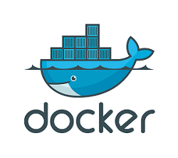

This project was bootstrapped with [Laravel](https://github.com/laravel/laravel).

# Proyect - Game Chat

## Table of Contents

- [About](#about)
- [Built With](#built)
- [Getting Started](#started)
- [Features](#features)
- [Testing with Postman](#testing)
- [Authors](#authors)

## About 

Back-end for a technology company in wich workers may register to create a party and invite more workmates.In the parties, the users can send messages among them and play games.

This is a educational project to [GeeksHubsAcademy](https://geekshubsacademy.com/), created by [Federico Báez](https://github.com/fbgoode) & [Jessica Morocho](https://github.com/Jesicamm) in Valencia, betwen 13/04/2021 - 19/04/2021.

## Built With 

    
     
     

## Getting Started 

### Heroku :
The app is deployed in Heroku, you can see it [here](https://game-chat-b.herokuapp.com/)

### If you want to clone, you need to have installed:
- Php
- Laravel
- Composer

### You need to run the next commands:
- Composer install
- php artisan serve

## Features 

* Player, Party, Message, Membership & Game resources.
* Resources on relational database with MySql.
* Register and Login with Passport.
* Auth with token required to access to the different endpoints.
* Seeder of 5 games.
* A player can create a party vinculated with a game and other players.
* Player can send messages in a party.

## Testing with Postman 

## Authors 

* [Federico Báez](https://github.com/fbgoode)
* [Jessica Morocho](https://github.com/Jesicamm)